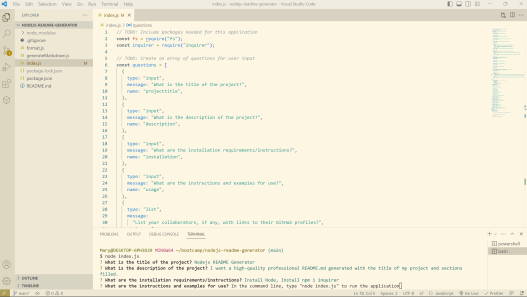
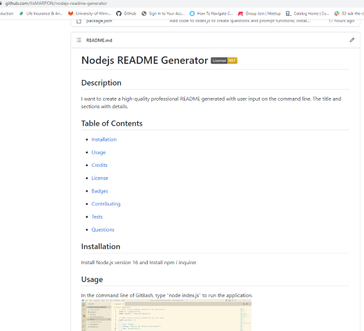
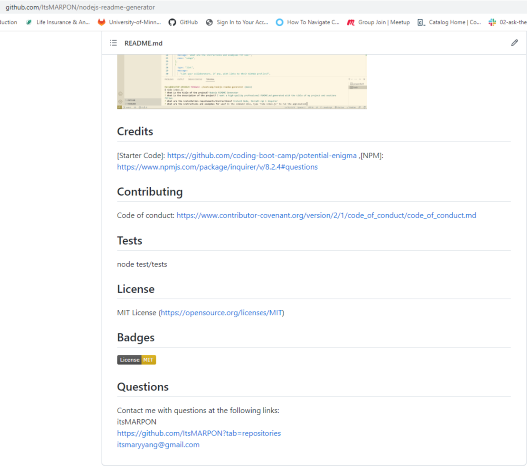

# Nodejs README Generator 
        
## Description
I want to create a high-quality professional README generated with user input on the command line. The title and sections with details.

## Table of Contents

- [Installation](#installation)

- [Usage](#usage)

- [Credits](#credits)

- [License](#license)

- [Badges](#badges)

- [Contributing](#contributing)

- [Tests](#tests)

- [Questions](#questions)

## Installation 
Install Node.js version 16 and Install npm i inquirer

## Usage 
In the command line of GitBash, type "node index.js" to run the application.
 

 

 

## Credits 
[Starter Code]: https://github.com/coding-boot-camp/potential-enigma ,[NPM]: https://www.npmjs.com/package/inquirer/v/8.2.4#questions 

## Contributing 
Code of conduct: https://www.contributor-covenant.org/version/2/1/code_of_conduct/code_of_conduct.md

## Tests 
node test/tests

## License 
Apache License 2.0 (https://opensource.org/licenses/Apache-2.0)

## Badges 

## Questions 
Contact me with questions at the following links:
 
itsMARPON
 
https://github.com/ItsMARPON?tab=repositories
 
itsmaryyang@gmail.com
      